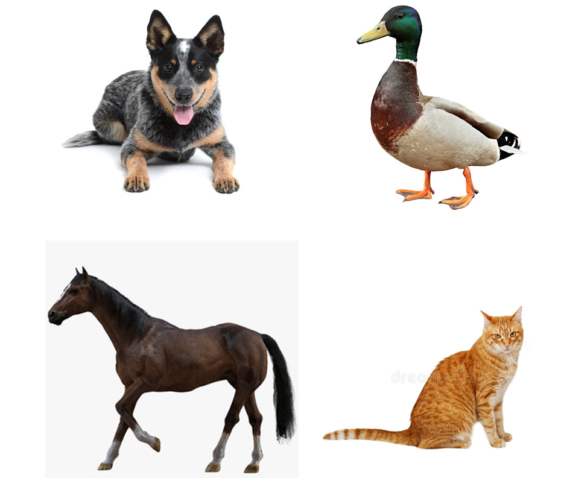
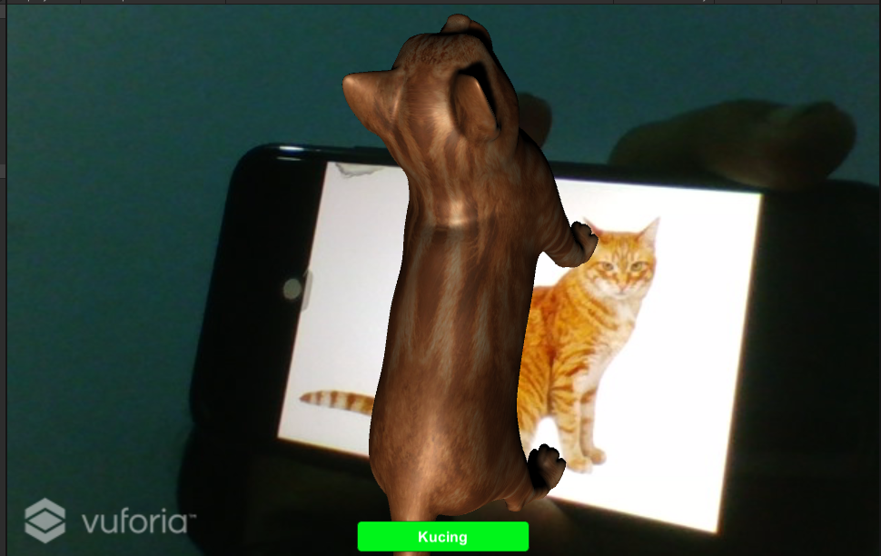
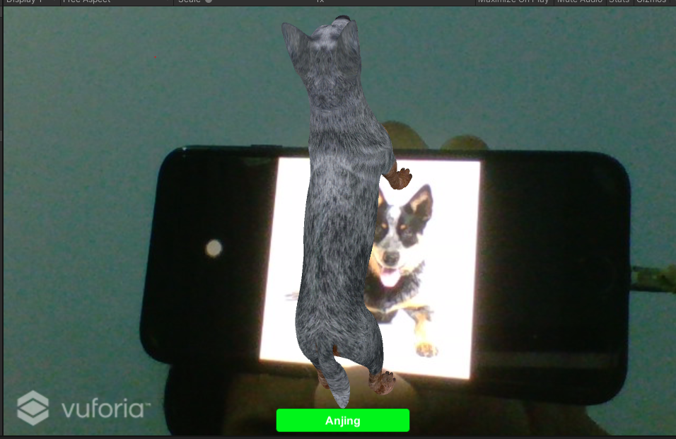
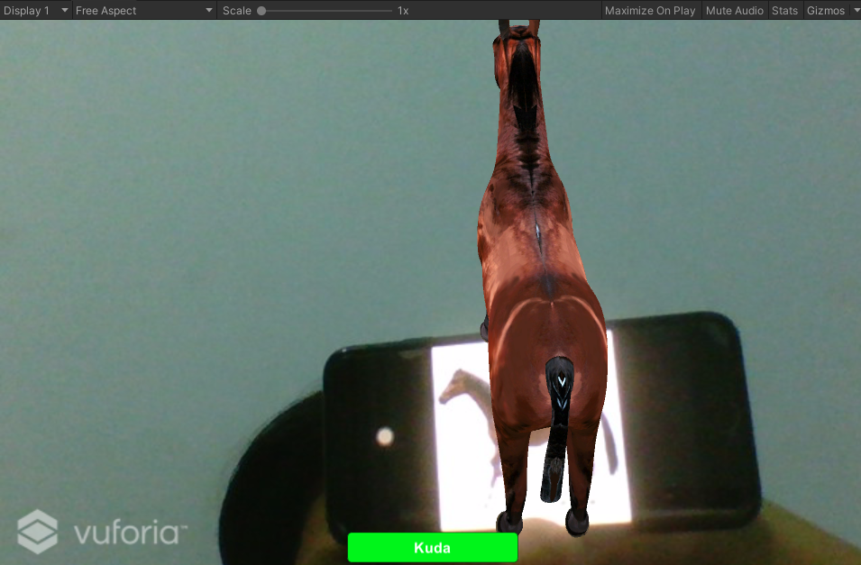
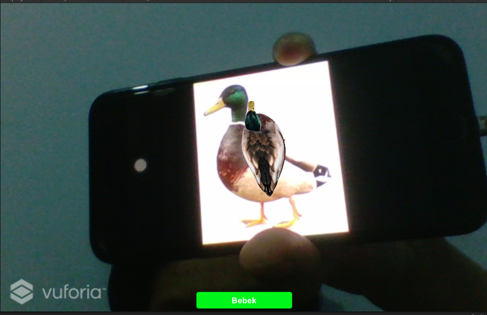
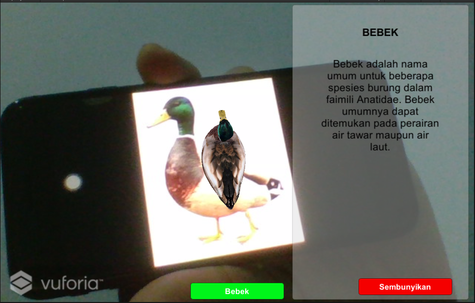

# UAS Pemrograman Game

## Deskripsi Aplikasi

Aplikasi yang dibuat merupakan pengenalan hewan dan deskripsi hewan tersebut. Aplikasi ditujukan untuk anak berusia 2-5 tahun

[Link Youtube](https://youtu.be/QrgIUDCNyu0)

## Hasil Akhir

- Image Target
  

- Object

1. Kucing
   

2. Anjing
   

3. Kuda
   

4. Bebek
   

- Contoh Object & Deskripsi
  
